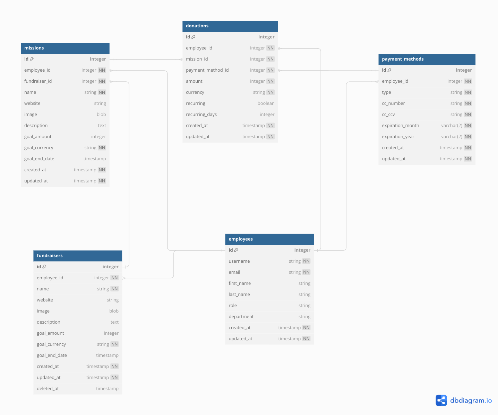
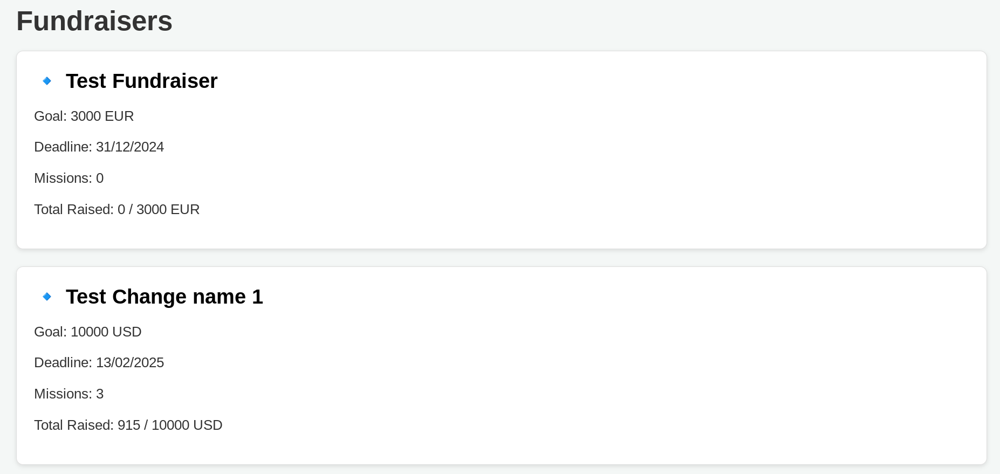
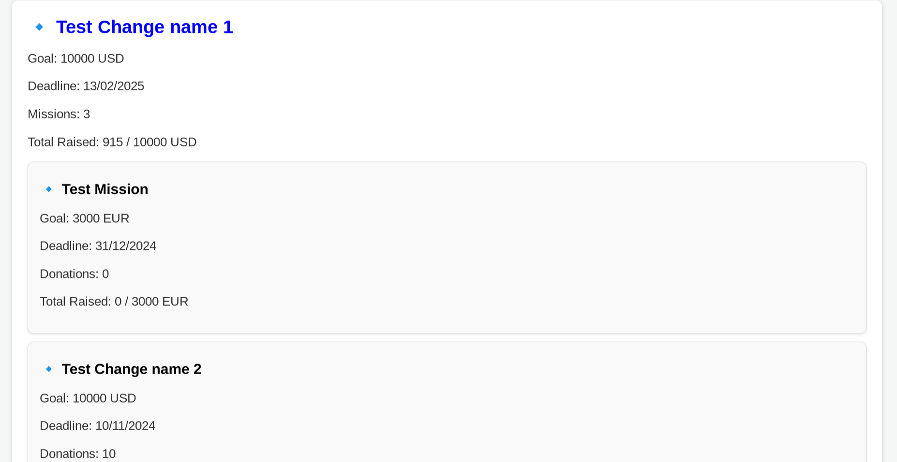
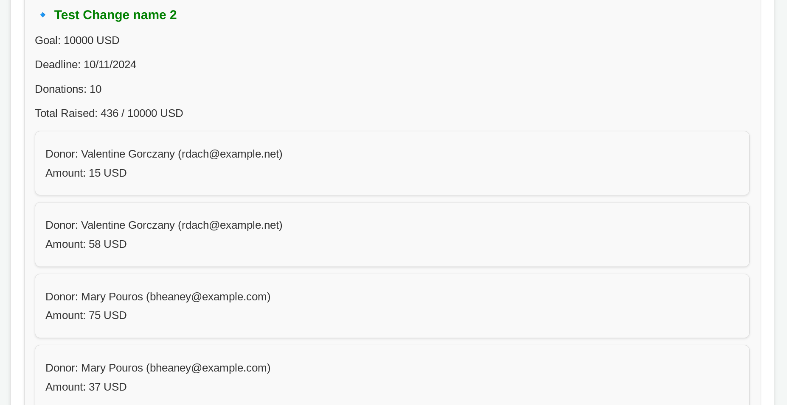

# DOCUMENTATION

The following project is a demo application that has:
* Database and full API definition
* Fundraisers and Donations Single Page Application

The idea is to build the following application using 
[LeafPHP Framework](https://leafphp.dev/). This Framework has been chosen 
over Laravel, because I already have working knowledge with it and due to 
the tight timeline of development, it's a better choice. However 
**LeafPHP** is very similar to Laravel, having both Inertia 
and Vite for working with JSX pages and Eloquent ORM for the database.

A Live version of the App is accessible at: https://demo.asplanned.app

## What is being left out

For the purpose of the test, it is being left out:

* User authentication
* Mailing system
* Content pages (terms, privacy, etc)

## Database Structure



Diagram built with: [DBDiagram.io](https://dbdiagram.io/)


### Implementation

Database entities have been implemented using the deafult LeafPHP 
functionalities. For each database table it has been created:

* `app/database/schema/[table].json`
* `app/database/migrations/[date_id_table].php`
* `app/models/[table].php`

That ensure consistency across the different tables, and the validity
of the foreign-keys and default timestamp values.

In addion, the framework allows to create 'Seeders' that pre-popoluate
the databse with test data. A seeder is created using two classes:

* `app/database/factories/[table]Factory.php`
* `app/database/seeds/[table]Seeder.php`

The first one defining the seeds data using the Faker library (and some
random IDs), and the second one deciding how many fake entries for each
table to create.

## Linters and Validations

The systems uses several Linters to enforce Coding standards for both
PHP and JS code. Specifically:

* PHPCS for Code Validation
* PHPStan for Code Consistency
* RectorPHP for Best Practices
* ESLint for JSX Pages


## API Endpoints

A Postman Collection is available in the [Project's Assets](./assets/postman/collection/Demo%20App.postman_collection.json)

### Employees

#### POST /employees

<details>
    <summary>Payload</summary>

```json
{
  "username": "test.foo",
  "email": "test.foo@example.org",
  "first_name": "Test",
  "last_name": "Food",
  "role": "Software Developer",
  "department": "IT"
}
```
</details>

<details>
    <summary>Success Response</summary>

```json
{
  "id": 1,
  "username": "test.foo",
  "email": "test.foo@example.org",
  "first_name": "Test",
  "last_name": "Food",
  "role": "Software Developer",
  "department": "IT",
  "created_at": "2024-06-17T21:58:00.000000Z",
  "updated_at": "2024-06-17T21:58:36.000000Z"
}
```
</details>

<details>
    <summary>Error Responses</summary>

- 406 Not valid data
- 422 Missing mandatory field
- 500 Exception
</details>

#### GET /employees/{employee_id}

<details>
    <summary>Payload</summary>

```
No payload
```
</details>

<details>
    <summary>Success Response</summary>

```json
{
  "id": 1,
  "username": "test.foo",
  "email": "test.foo@example.org",
  "first_name": "Test",
  "last_name": "Food",
  "role": "7VkIem3Tpi",
  "department": "xs7eJHLqoH",
  "created_at": "2024-06-17T21:58:00.000000Z",
  "updated_at": "2024-06-17T21:58:36.000000Z"
}
```
</details>

<details>
    <summary>Error Responses</summary>

- 404 Not found
- 406 Not valid data
- 422 Missing mandatory field
- 500 Exception
</details>

#### PUT /employees/{employee_id}

<details>
    <summary>Payload</summary>

```json
{
  "username": "updated.foo",
  "email": "updated.foo@example.org",
  "first_name": "Updated",
  "last_name": "Foo",
  "role": "Senior Developer",
  "department": "Engineering"
}
```
</details>

<details>
    <summary>Success Response</summary>

```
204 No Content
```
</details>

<details>
    <summary>Error Responses</summary>

- 404 Not found
- 406 Not valid data
- 422 Missing mandatory field
- 500 Exception
</details>

### Payment Methods


#### POST /employees/{employee_id}/payment-method/

<details>
    <summary>Payload</summary>

```json
{
  "type": "credit_card",
  "cc_number": "4111111111111111",
  "cc_ccv": "123",
  "expiration_month": "12",
  "expiration_year": "2025"
}
```
</details>

<details>
    <summary>Success Response</summary>

```json
{
  "id": 1,
  "employee_id": 1,
  "type": "credit_card",
  "cc_number": "4111111111111111",
  "cc_ccv": "123",
  "expiration_month": "12",
  "expiration_year": "2025",
  "created_at": "2024-06-17T21:58:00.000000Z",
  "updated_at": "2024-06-17T21:58:36.000000Z"
}
```
</details>

<details>
    <summary>Error Responses</summary>

- 406 Not valid data
- 422 Missing mandatory field
- 500 Exception
</details>

#### GET /employees/{employee_id}/payment-method/{payment_method_id}

<details>
    <summary>Payload</summary>

```
No payload
```
</details>

<details>
    <summary>Success Response</summary>

```json
{
  "id": 1,
  "employee_id": 1,
  "type": "credit_card",
  "cc_number": "4111111111111111",
  "cc_ccv": "123",
  "expiration_month": "12",
  "expiration_year": "2025",
  "created_at": "2024-06-17T21:58:00.000000Z",
  "updated_at": "2024-06-17T21:58:36.000000Z"
}
```
</details>

<details>
    <summary>Error Responses</summary>

- 404 Not found
- 406 Not valid data
- 422 Missing mandatory field
- 500 Exception
</details>

### Fundraisers


#### GET /fundraisers/?page=1&expand=1

<details>
    <summary>Payload</summary>

```
No payload
```

</details>

<details>
    <summary>Success Response</summary>

```json
{
  "fundraisers": [
    {
      "id": 2,
      "employee_id": 1,
      "name": "Test Fundraiser",
      "website": "https://www.testwebsite.com",
      "description": "This is a Test Fundraiser inserted from API",
      "goal_amount": 3000,
      "goal_currency": "EUR",
      "goal_end_date": "2024-12-31T00:00:00.000000Z",
      "created_at": "2024-06-17T21:58:37.000000Z",
      "updated_at": "2024-06-17T21:58:37.000000Z"
    },
    {
      "id": 1,
      "employee_id": 1,
      "name": "Test Change name 1",
      "website": "https://www.test.foo",
      "description": "Random Description change for Fundraiser",
      "goal_amount": 10000,
      "goal_currency": "USD",
      "goal_end_date": "2025-05-19T23:30:27.000000Z",
      "created_at": "2024-06-17T21:58:01.000000Z",
      "updated_at": "2024-06-17T21:58:37.000000Z"
    }
  ],
  "_collections": {
    "employees": {
      "1": {
        "id": 1,
        "username": "test.foo",
        "email": "test.foo@example.org",
        "first_name": "Test",
        "last_name": "Food",
        "role": "7VkIem3Tpi",
        "department": "xs7eJHLqoH",
        "created_at": "2024-06-17T21:58:00.000000Z",
        "updated_at": "2024-06-17T21:58:36.000000Z"
      }
    }
  },
  "_pages": {
    "current": 1,
    "total": 1
  }
}
```

</details>

<details>
    <summary>Error Responses</summary>

- 404 Not found
```json
{
  "fundraisers": [],
  "_collections": [],
  "_pages": {
    "current": 5,
    "total": 1
  }
}
```
- 406 Not valid data
- 422 Missing mandatory field
- 500 Exception

</details>

#### POST /fundraisers

<details>
    <summary>Payload</summary>

```json
{
  "employee_id": 1,
  "name": "Test Fundraiser",
  "website": "https://www.testwebsite.com",
  "description": "This is a Test Fundraiser inserted from API",
  "goal_amount": 3000,
  "goal_currency": "EUR",
  "goal_end_date": "2024-12-31T00:00:00.01Z"
}
```

</details>

<details>
    <summary>Success Response</summary>

```json
{
  "employee_id": 1,
  "name": "Test Fundraiser",
  "website": "https://www.testwebsite.com",
  "description": "This is a Test Fundraiser inserted from API",
  "goal_amount": 3000,
  "goal_currency": "EUR",
  "goal_end_date": "2024-12-31T00:00:00.000000Z",
  "updated_at": "2024-06-17T22:08:17.000000Z",
  "created_at": "2024-06-17T22:08:17.000000Z",
  "id": 3
}
```

</details>

<details>
    <summary>Error Responses</summary>

- 406 Not valid data
- 422 Missing mandatory field
- 500 Exception

</details>

#### GET /fundraisers/{fundraiser_id}

<details>
    <summary>Payload</summary>

```
No payload

```

</details>

<details>
    <summary>Success Response</summary>

```json
{
  "id": 1,
  "employee_id": 2,
  "name": "Keeling, Balistreri and Conn",
  "website": "https://www.farrell.com",
  "description": "Adipisci quidem ducimus beatae aut consequatur totam autem. Voluptatem et architecto nihil rerum accusamus. Esse architecto atque quia.",
  "goal_amount": 13705,
  "goal_currency": "EUR",
  "goal_end_date": "2025-05-22T23:34:30.000000Z",
  "created_at": "2024-06-17T14:54:31.000000Z",
  "updated_at": "2024-06-17T14:54:31.000000Z"
}
```

</details>

<details>
    <summary>Error Responses</summary>

- 404 Not found
- 406 Not valid data
- 422 Missing mandatory field
- 500 Exception

</details>

#### PUT /fundraisers/{fundraiser_id}

<details>
    <summary>Payload</summary>

```json
{
  "name": "Updated Fundraiser",
  "website": "https://www.updatedwebsite.com",
  "description": "Updated description",
  "goal_amount": 5000,
  "goal_currency": "USD",
  "goal_end_date": "2025-12-31T00:00:00.01Z"
}
```

</details>

<details>
    <summary>Success Response</summary>

```
204 No Content
```

</details>

<details>
    <summary>Error Responses</summary>

- 404 Not found
- 406 Not valid data
- 422 Missing mandatory field
- 500 Exception
</details>

### Missions


#### GET /fundraisers/{fundraiser_id}/missions/?page=1&expand=1

<details>
    <summary>Payload</summary>

```
No payload
```

</details>

<details>
    <summary>Success Response</summary>

```json
{
  "missions": [
    {
      "id": 2,
      "employee_id": 1,
      "fundraiser_id": 1,
      "name": "Test Mission",
      "website": "https://www.testwebsite.com",
      "description": "This is a Test Mission inserted from API",
      "goal_amount": 3000,
      "goal_currency": "EUR",
      "goal_end_date": "2024-12-31T00:00:00.000000Z",
      "created_at": "2024-06-17T21:58:37.000000Z",
      "updated_at": "2024-06-17T21:58:37.000000Z"
    },
    {
      "id": 1,
      "employee_id": 1,
      "fundraiser_id": 1,
      "name": "Test Change name 1",
      "website": "https://www.test.foo",
      "description": "Random Description change for Mission",
      "goal_amount": 10000,
      "goal_currency": "USD",
      "goal_end_date": "2025-05-19T23:30:27.000000Z",
      "created_at": "2024-06-17T21:58:01.000000Z",
      "updated_at": "2024-06-17T21:58:37.000000Z"
    }
  ],
  "_collections": {
    "employees": {
      "1": {
        "id": 1,
        "username": "test.foo",
        "email": "test.foo@example.org",
        "first_name": "Test",
        "last_name": "Food",
        "role": "7VkIem3Tpi",
        "department": "xs7eJHLqoH",
        "created_at": "2024-06-17T21:58:00.000000Z",
        "updated_at": "2024-06-17T21:58:36.000000Z"
      }
    },
    "fundraisers": {
      "1": {
        "id": 1,
        "employee_id": 1,
        "name": "Test Fundraiser",
        "website": "https://www.testwebsite.com",
        "description": "This is a Test Fundraiser inserted from API",
        "goal_amount": 3000,
        "goal_currency": "EUR",
        "goal_end_date": "2024-12-31T00:00:00.000000Z",
        "created_at": "2024-06-17T21:58:01.000000Z",
        "updated_at": "2024-06-17T21:58:37.000000Z"
      }
    }
  },
  "_pages": {
    "current": 1,
    "total": 1
  }
}
```

</details>

<details>
    <summary>Error Responses</summary>

- 404 Not found
```json
{
  "missions": [],
  "_collections": [],
  "_pages": {
    "current": 5,
    "total": 1
  }
}
```
- 406 Not valid data
- 422 Missing mandatory field
- 500 Exception

</details>

#### POST /fundraisers/{fundraiser_id}/missions/

<details>
    <summary>Payload</summary>

```json
{
  "employee_id": 1,
  "name": "Test Mission",
  "website": "https://www.testwebsite.com",
  "description": "This is a Test Mission inserted from API",
  "goal_amount": 3000,
  "goal_currency": "EUR",
  "goal_end_date": "2024-12-31T00:00:00.01Z"
}
```

</details>

<details>
    <summary>Success Response</summary>

```json
{
  "employee_id": 1,
  "fundraiser_id": 1,
  "name": "Test Mission",
  "website": "https://www.testwebsite.com",
  "description": "This is a Test Mission inserted from API",
  "goal_amount": 3000,
  "goal_currency": "EUR",
  "goal_end_date": "2024-12-31T00:00:00.000000Z",
  "updated_at": "2024-06-17T22:08:17.000000Z",
  "created_at": "2024-06-17T22:08:17.000000Z",
  "id": 3
}
```

</details>

<details>
    <summary>Error Responses</summary>

- 406 Not valid data
- 422 Missing mandatory field
- 500 Exception

</details>

#### GET /fundraisers/{fundraiser_id}/missions/{mission_id}

<details>
    <summary>Payload</summary>

```
No payload
```

</details>

<details>
    <summary>Success Response</summary>

```json
{
  "id": 1,
  "employee_id": 2,
  "fundraiser_id": 1,
  "name": "Keeling, Balistreri and Conn",
  "website": "https://www.farrell.com",
  "description": "Adipisci quidem ducimus beatae aut consequatur totam autem. Voluptatem et architecto nihil rerum accusamus. Esse architecto atque quia.",
  "goal_amount": 13705,
  "goal_currency": "EUR",
  "goal_end_date": "2025-05-22T23:34:30.000000Z",
  "created_at": "2024-06-17T14:54:31.000000Z",
  "updated_at": "2024-06-17T14:54:31.000000Z"
}
```

</details>

<details>
    <summary>Error Responses</summary>

- 404 Not found
- 406 Not valid data
- 422 Missing mandatory field
- 500 Exception

</details>

#### PUT /fundraisers/{fundraiser_id}/missions/{mission_id}

<details>
    <summary>Payload</summary>

```json
{
  "name": "Updated Mission",
  "website": "https://www.updatedwebsite.com",
  "description": "Updated description",
  "goal_amount": 5000,
  "goal_currency": "USD",
  "goal_end_date": "2025-12-31T00:00:00.01Z"
}
```

</details>

<details>
    <summary>Success Response</summary>

```
204 No Content
```

</details>

<details>
    <summary>Error Responses</summary>

- 404 Not found
- 406 Not valid data
- 422 Missing mandatory field
- 500 Exception

</details>

### Donations

#### GET /fundraisers/{fundraiser_id}/missions/{mission_id}/donations/?page=1&expand=1

<details>
    <summary>Payload</summary>

```
No payload
```

</details>

<details>
    <summary>Success Response</summary>

```json
{
  "donations": [
    {
      "id": 2,
      "employee_id": 1,
      "mission_id": 1,
      "payment_method_id": 1,
      "amount": 15,
      "currency": "EUR",
      "created_at": "2024-06-17T21:58:37.000000Z",
      "updated_at": "2024-06-17T21:58:37.000000Z"
    },
    {
      "id": 1,
      "employee_id": 1,
      "mission_id": 1,
      "payment_method_id": 1,
      "amount": 20,
      "currency": "USD",
      "created_at": "2024-06-17T21:58:01.000000Z",
      "updated_at": "2024-06-17T21:58:37.000000Z"
    }
  ],
  "_collections": {
    "employees": {
      "1": {
        "id": 1,
        "username": "test.foo",
        "email": "test.foo@example.org",
        "first_name": "Test",
        "last_name": "Food",
        "role": "7VkIem3Tpi",
        "department": "xs7eJHLqoH",
        "created_at": "2024-06-17T21:58:00.000000Z",
        "updated_at": "2024-06-17T21:58:36.000000Z"
      }
    },
    "fundraisers": {
      "1": {
        "id": 1,
        "employee_id": 1,
        "name": "Test Fundraiser",
        "website": "https://www.testwebsite.com",
        "description": "This is a Test Fundraiser inserted from API",
        "goal_amount": 3000,
        "goal_currency": "EUR",
        "goal_end_date": "2024-12-31T00:00:00.000000Z",
        "created_at": "2024-06-17T21:58:01.000000Z",
        "updated_at": "2024-06-17T21:58:37.000000Z"
      }
    },
    "missions": {
      "1": {
        "id": 1,
        "employee_id": 1,
        "fundraiser_id": 1,
        "name": "Test Mission",
        "website": "https://www.testwebsite.com",
        "description": "This is a Test Mission inserted from API",
        "goal_amount": 3000,
        "goal_currency": "EUR",
        "goal_end_date": "2024-12-31T00:00:00.000000Z",
        "created_at": "2024-06-17T21:58:01.000000Z",
        "updated_at": "2024-06-17T21:58:37.000000Z"
      }
    }
  },
  "_pages": {
    "current": 1,
    "total": 1
  }
}
```

</details>

<details>
    <summary>Error Responses</summary>

- 404 Not found
```json
{
  "donations": [],
  "_collections": [],
  "_pages": {
    "current": "5",
    "total": 1
  }
}
```
- 406 Not valid data
- 422 Missing mandatory field
- 500 Exception

</details>

#### POST /fundraisers/{fundraiser_id}/missions/{mission_id}/donations/

<details>
    <summary>Payload</summary>

```json
{
  "employee_id": 2,
  "payment_method_id": 1,
  "amount": 15,
  "currency": "EUR"
}
```

</details>

<details>
    <summary>Success Response</summary>

```json
{
  "employee_id": 2,
  "mission_id": 1,
  "payment_method_id": 1,
  "amount": 15,
  "currency": "EUR",
  "updated_at": "2024-06-17T22:08:17.000000Z",
  "created_at": "2024-06-17T22:08:17.000000Z",
  "id": 3
}
```

</details>

<details>
    <summary>Error Responses</summary>

- 406 Not valid data
- 422 Missing mandatory field
- 500 Exception

</details>

#### GET /fundraisers/{fundraiser_id}/missions/{mission_id}/donations/{donation_id}

<details>
    <summary>Payload</summary>

```
No payload
```

</details>

<details>
    <summary>Success Response</summary>

```json
{
  "id": 1,
  "employee_id": 2,
  "mission_id": 1,
  "payment_method_id": 1,
  "amount": 15,
  "currency": "EUR",
  "created_at": "2024-06-17T14:54:31.000000Z",
  "updated_at": "2024-06-17T14:54:31.000000Z"
}
```

</details>

<details>
    <summary>Error Responses</summary>

- 404 Not found
- 406 Not valid data
- 422 Missing mandatory field
- 500 Exception

</details>

## JSX Template

The FE application is a single JSX page that levarage the APIs to build a simple, 
but effective, way to navigate the Fundraisers, their Missions and Donations.
The idea is to show a very simple way of browsing and aggregating the data, so that 
we can see the deadlines, the pledged donations and the different Goals. 

The App is accessible at the URL: http://localhost:5500/

### List of Fundraisers


### List of Missions


### List of Donations



## TODO

* Add [Docker Support](https://leafphp.dev/docs/introduction/docker.html)
* Add a payment system (can be used [Cashier](https://laravel.com/docs/11.x/billing) from Laravel)
* Add JEST Combined Test Coverage
* Additional security with JWT Tokens and Signed payload
* Add to Github workflow (Linters + Tests + Postman)
